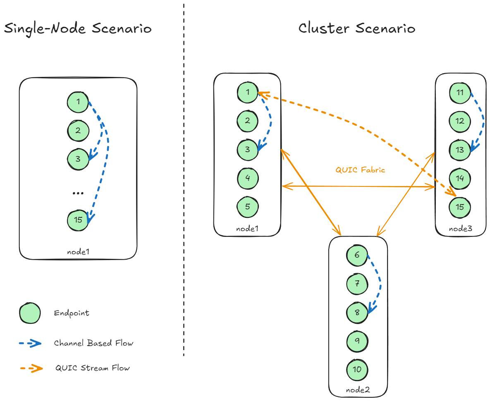

# Example: `flexible-topology`



This example shows the power of `grinta` when it comes to
flexible topology:
* It runs $15$ *Endpoints* named with an integer $id \in [1, 15]$.
* It also starts $15$ *Goroutines* which will randomly contact
  one of the *Endpoint* with at a random period.
* A **Cluster** version do the same while distributing the
  load over 3 separate processes inter-connected over the loopback
  interface using the **GRINTA Protocol**.

Note how each *Endpoint* can be moved to different nodes without
code change, the *Fabric* will automatically use the good transport
implementation.

All you have to do is write your code using `grinta`'s API from day one
(`Fabric` > `Endpoint` > `Flow`), then, if you need to scale your
app to the point it must be split over multiple nodes, you just need
to prepare mTLS certificates and inter-connect your nodes.

For example, this is the single-node version:

```shell
# Provide mTLS, set node name to "node1" run endpoint until ID 16,
# specify "-max 15" so the range of dialed endpoint by Goroutines
# goes from 1 to 15 (included), on port 6001.
go run . -tls-ca ca.crt -tls-cert leaf.crt -tls-key leaf.key \
		-hostname "node1" -until 16 -max 15 -port 6001
```

... and the cluster one:

```shell
# on machine 1
go run . -tls-ca ca.crt -tls-cert leaf.crt -tls-key leaf.key \
		-hostname "node1" -until 6 -max 15 -port 6001

# on machine 2
go run . -tls-ca ca.crt -tls-cert leaf.crt -tls-key leaf.key \
		-hostname "node2" -from 6 -until 11 -max 15 -port 6002 \
		-neighbours localhost:6001

# on machine 3
go run . -tls-ca ca.crt -tls-cert leaf.crt -tls-key leaf.key \
		-hostname "node3" -from 11 -until 16 -max 15 -port 6003 \
		-neighbours localhost:6002
```

As you can see, with a few flags we can distribute our app :sparkles:.

## Single-Node

```
make run-single-node1
```

## Cluster

(In 3 different shell)

```
make run-cluster-node1
make run-cluster-node2
make run-cluster-node3
```